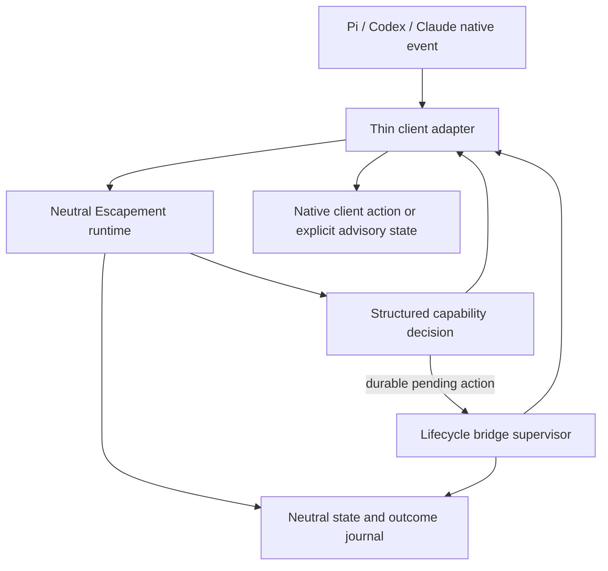

# Client-Neutral Capability Runtime

## Problem Statement

Escapement currently has shared behavior, but its authority is still organized around client surfaces: Codex-derived gate inventory, Claude-owned Python hooks, and a Pi adapter that consumes a subset of the Codex path. Capabilities are therefore reused across clients without one client-neutral contract. The implementation can say that a capability is shared while its source of truth, lifecycle assumptions, and enforcement semantics still belong to one host.

This must change before the first public release. The repository has no prior release history, and publishing the current topology would turn host-specific paths into an accidental compatibility contract. The cost of inaction is semantic drift between Pi, Codex, and Claude, inaccurate support claims, duplicated fixes, and a growing migration cost whenever a capability moves between clients. Users should experience the same Escapement capability semantics regardless of which chosen client provides the agent session; client-specific differences should be explicit enforcement details, not different product behavior.

After this change, Escapement owns its capability semantics and durable state in a neutral runtime. Pi, Codex, and Claude translate native lifecycle events into that runtime and apply structured decisions through native client mechanisms. A shared lifecycle bridge supplies durable pending actions and wakeups where a client does not expose an equivalent native primitive. The first public release can then describe a capability contract rather than treating Claude as the reference host or Pi as a parity target.

## Non-Goals

1. Escapement will not become a generic policy DSL, authorization server, OPA/Cedar integration, or user-defined rule language. The capability vocabulary remains owned by Escapement code.
2. Escapement will not replace Pi, Codex, or Claude execution, permission, session, or user-interface systems. Adapters remain integrations with those clients.
3. The migration will not preserve old host-owned policy paths as compatibility aliases after cutover. The repository has no public release contract to protect, and dual authority would preserve the current failure mode.
4. Clients will not be required to expose identical hook names, UI, process topology, or timing. Neutral behavior is the contract; native mechanics are adapter details.
5. The first change will not invent new product capabilities beyond the current intended Escapement surface. It moves ownership and proves the contract before expanding scope.
6. Missing native enforcement will not be silently upgraded or hidden. An adapter must report hard, advisory, or unavailable realization for each capability it exposes.
7. The supervisor will not infer lifecycle events a client never emits, re-evaluate policy, or become a second policy engine.
8. Escapement will not claim ownership of unrelated personal configuration under client-specific home directories. It owns its installed runtime, neutral state, and declared adapter assets only.

### What This Is NOT

This is not a Pi-vs-Claude parity project, a universal agent replacement, a new task tracker, a general authorization framework, a host prompt-suppression bypass, or an always-on agent orchestrator. It is a source-of-truth and runtime-boundary change that makes existing Escapement capabilities neutral and projects them through chosen-client adapters.

## Capabilities

### New Capabilities

- `neutral-event-action-contract` — normalize client lifecycle events and return structured capability decisions and state transitions.
- `capability-registry` — identify capabilities, required event inputs, client adapter coverage, provenance, and enforcement level.
- `client-adapter-runtime` — load adapters, attach installed-client provenance, dispatch normalized events, and apply decisions without embedding policy in adapters.
- `lifecycle-bridge-supervisor` — persist pending lifecycle actions, perform requested wakeups, and invoke adapter-owned resume mechanisms.
- `cross-client-capability-oracle` — validate equivalent observable behavior across controlled Pi, Codex, and Claude fixtures using independent evidence.

### Modified Capabilities

- `outcome-contract` — becomes a neutral runtime capability rather than a host-hook behavior.
- `repo-outcome-authorization` — exposes neutral decisions and state transitions to every adapter.
- `continuation-harness` — moves durable continuation semantics into the neutral runtime and uses adapters only for client resumption.
- `durable-wakeup-registry` — stores capability-issued pending actions and preserves client provenance.
- `stop-barrier-supervisor` — consumes neutral lifecycle state and distinguishes hard, advisory, and unavailable enforcement.
- `intervention-event-model` — becomes the common event/action vocabulary instead of a client-specific normalization layer.
- `agent-surface-parity` — validates capability claims and installed-version fixtures per adapter, without treating one client as the source host.
- Generated instruction, package, hook, and marketplace surfaces — project neutral capability metadata and adapter status from canonical sources.

## Stakeholders

- **Decision authority and approver:** the repository owner, who owns the capability boundary and first-public-release intent.
- **Workflow-policy owner:** the neutral Escapement runtime and committed repository declarations.
- **Implementation population:** maintainers who move current policy behavior into the neutral runtime and maintain Pi, Codex, and Claude adapters.
- **Behavioral population:** users running Escapement sessions through Pi, Codex, or Claude, including parent sessions and subagents.
- **Adapter evidence sources:** installed client versions, public payload contracts, controlled fixtures, and native point-of-effect observations. Documentation alone cannot establish readiness.
- **Task-state provider:** Beads remains task/dependency state and is not an authority source for capability decisions.

## Impact

### Source topology

Current policy implementations under host-oriented paths become neutral runtime sources. Proposed ownership is under the existing `harness/` runtime boundary, with neutral capability/event modules and client adapter modules beneath it. Exact module names follow the first vertical slice, but the invariant is fixed: no neutral policy implementation is sourced from `claude/hooks`, Codex hook entry points, or the Pi TypeScript extension.

The following become thin adapters or generated launchers:

- Claude hook entry points and Claude plugin metadata;
- Codex hook dispatch and Codex plugin metadata;
- the Pi TypeScript extension and Pi package metadata;
- generated `AGENTS.md`, `CLAUDE.md`, `PI.md`, `gates.json`, and marketplace surfaces.

`agent-surfaces/manifest.json` remains the distribution and capability registry, but `gate_source_host` and equivalent host-derived authority fields are removed or replaced with neutral capability ownership and per-adapter evidence.

### Runtime data flow

A native client event is normalized into an event containing capability kind, session/actor/repository/worktree identity, client/version provenance, correlation identity, and a typed payload. The neutral runtime evaluates policy and state, returning a decision containing capability identity, action, enforcement level, state transition, explanation, and correlation identity. The adapter applies immediate decisions. Durable pending actions are persisted for the lifecycle bridge supervisor.

The neutral state root must remain separate from unrelated client configuration and must preserve enough provenance to explain which adapter and installed client version produced an observation.

### Deployment

Native package/plugin installation remains host-specific. Effective deployment installs the neutral runtime, selected adapters, generated metadata, and the shared lifecycle bridge where configured. Updaters and installers must converge the same neutral runtime state rather than maintaining parallel host-specific policy trees.

### Verification

The first proof requires controlled fixtures for all three selected clients: Pi, Codex, and Claude. The independent oracle must inspect native event/output evidence, neutral state, supervisor activity, and user-visible adapter behavior. A passing unit test that only echoes a normalized object is insufficient.

## Architecture Context

The runtime has four separable responsibilities:

1. **Capability contract:** stable event and decision vocabulary independent of host hook names.
2. **Policy/state:** authority, outcome, oracle, intervention, task/repository, and continuation state transitions.
3. **Adapter boundary:** native event decoding, installed-version provenance, and native decision application.
4. **Lifecycle bridge:** durable pending actions, wakeups, and adapter-mediated resumption only.

The immediate tool path remains synchronous where the client supports it. The supervisor is not launched for every Bash or file event. It is used only when the neutral runtime emits a durable lifecycle action that cannot be completed inline.

An adapter declares realization for each capability as `hard`, `advisory`, or `unavailable`. The runtime decision remains neutral even when the adapter cannot enforce it mechanically. Advisory mode is visible to the user and persisted with provenance; it is never silently treated as hard enforcement.

## Riskiest Assumption

We believe all currently intended Escapement capabilities, including the hardest lifecycle behavior around outcome/oracle continuation, can be represented as neutral events, state transitions, and structured decisions, then realized by thin Pi, Codex, and Claude adapters or the shared lifecycle bridge. We will know this is true when one controlled continuation/oracle slice produces the same durable state transition and equivalent user-visible outcome through all three installed clients, with independent native evidence and explicit hard/advisory status. If false, we will retain only the neutral event and state envelope, identify the irreducibly host-specific capability, and revise that capability's contract instead of preserving host-owned policy as a hidden source of truth.

This assumption is live immediately: discovering after the first migration phases that continuation or oracle behavior requires Claude-owned semantics would invalidate the source topology, adapter boundary, supervisor scope, and first-release capability claims.

The embedded alternative is an observer-only federation in which each client writes its own native event schema and Escapement reports differences without issuing shared decisions or continuation actions. That is cheaper, but it cannot deliver client-neutral behavior and therefore does not satisfy the intended outcome.

## Walking Skeleton

1. **Define and fixture the neutral lifecycle event/action contract.** Capture controlled Pi, Codex, and Claude turn/intervention events and independently label the expected outcome, state transition, and enforcement realization. The contract must reject missing identity or ambiguous lifecycle input rather than inventing an allow.
2. **Implement one neutral outcome/oracle continuation slice.** Move the minimum required state and policy logic into the neutral runtime. Each adapter must emit the normalized event, receive the same structured decision, and record the same pending action without sharing host policy code.
3. **Exercise the lifecycle bridge across all three clients.** Rehydrate the pending action through the supervisor; invoke native resumption where supported and produce explicit advisory state where not. Independently inspect native output, neutral state, supervisor activity, and the resulting user-visible behavior.

The skeleton deliberately excludes the full gate inventory, broad documentation regeneration, and every historical hook. Those follow only after the hardest neutral lifecycle assumption is proven.

## Proof of Delivery

This is done when controlled Pi, Codex, and Claude sessions produce the same neutral outcome/oracle continuation state and equivalent user-visible result through thin adapters, with hard/advisory realization explicit and no host-specific policy source remaining authoritative.

## Anti-Metrics

1. The change has failed even if all adapter tests pass if maintainers still need to edit Claude or Codex policy files to change a neutral capability.
2. The change has failed even if prompt counts fall if the supervisor silently auto-allows, hides, or loses a pending consequential action.
3. The change has failed even if package installation succeeds if users receive different capability semantics based on client selection without an explicit enforcement-status explanation.
4. The change has failed even if the new runtime grows quickly if every tool call starts a separate supervisor process or duplicates policy evaluation.

## Phased Delivery

### Phase 1 (Walking Skeleton)

Prove the neutral event/action contract and outcome/oracle continuation through Pi, Codex, and Claude. Establish the adapter registration format, neutral state record, explicit enforcement levels, and lifecycle bridge boundary. This phase is the only committed implementation scope before the riskiest assumption is validated.

### Phase 2

[PLACEHOLDER] — Migrate the existing intervention, outcome, repository-authorization, and continuation behavior into the neutral runtime; replace current host-owned gate imports with thin adapters; and regenerate capability metadata. Define the phase skeleton after Phase 1 exposes the exact contract gaps.

### Phase 3

[PLACEHOLDER] — Migrate the remaining current gates and lifecycle surfaces, remove obsolete host-specific source paths, align installers/updaters, and establish the first public `0.x` release contract. Define the phase skeleton after Phase 2 proves migration coverage.

## Decisions

1. **Neutral runtime is the source of truth.** Host surfaces are projections and adapters. A shared implementation is insufficient if its source path or lifecycle contract still belongs to one client.
2. **Pi, Codex, and Claude are selected clients.** The architecture is open to future adapters, but this change proves the contract against these three clients rather than designing an abstract marketplace for unknown hosts.
3. **Clean cutover is preferred.** There is no previous public release to preserve. Compatibility aliases would retain duplicate authority and make drift harder to detect.
4. **Lifecycle bridge, not full orchestrator.** Immediate decisions stay inline; only durable pending lifecycle actions go through the supervisor. A full always-on orchestrator would expand Escapement into an agent execution platform.
5. **Behavior is the primary oracle; structure is mandatory scope.** Equivalent user-visible outcomes prove the capability, while neutral ownership and thin adapters prevent the next drift cycle.
6. **Explicit advisory mode is the failure policy.** A client may be unable to enforce a capability mechanically, but that status must be visible, persisted, and distinguishable from hard enforcement.
7. **Capability metadata replaces host-derived support claims.** Generated surfaces may describe current adapter coverage and evidence, but no client is the authority for a neutral capability.
8. **The hardest lifecycle capability is the first proof.** Bash/file gate reuse is not sufficient evidence because it does not test durable state, resumption, or enforcement degradation.

## Risks & Trade-offs

- **Neutral contract cannot express a host-specific lifecycle nuance** → test continuation/oracle first; preserve an explicit capability-specific adapter boundary only when independent evidence proves the nuance cannot be normalized.
- **Moving many Python gates breaks imports and deployed wrappers** → migrate through generated entry points, run import-resolution checks, and keep rollback at the repository commit boundary rather than retaining aliases.
- **Supervisor duplicates continuation authority** → require every durable action to carry a neutral request identity and state transition; the supervisor executes only runtime-issued actions.
- **Advisory mode becomes an unnoticed safety downgrade** → emit and persist enforcement level in every decision, render it in client status, and reject missing/ambiguous capability declarations.
- **Existing completed designs conflict with the new source topology** → treat this change as the implementation-boundary successor; preserve their behavioral invariants and explicitly supersede only host-centric ownership decisions.
- **The first skeleton overfits one client** → require all three adapters to produce controlled evidence before calling the contract validated.
- **Generated surfaces drift from the registry** → make renderer checks bidirectional and fail when a generated claim lacks a capability or fixture source.

## Migration Plan

1. Inventory current intended capabilities, policy sources, lifecycle inputs, and point-of-effect tests. Mark each as neutral candidate, adapter concern, or unsupported evidence that must be resolved.
2. Add the neutral event/action contract, adapter registration, enforcement-level representation, and state-record schema without deleting current sources.
3. Land the walking skeleton and independent cross-client oracle first. Do not retire a host source until the corresponding neutral behavior has a positive and negative control.
4. Move the first proven capability into the neutral runtime and convert Pi, Codex, and Claude entry points to adapters.
5. Migrate remaining capabilities in dependency order, updating generated metadata and installation/updater paths as each source moves.
6. Remove obsolete host-owned policy modules, aliases, and derived-source fields. Run renderer, import-resolution, adapter, supervisor, and behavioral checks.
7. Tag the first public pre-1.0 release only after the neutral capability contract and selected-client install paths are verified. The initial release should remain explicitly experimental.

Rollback is a clean repository revert to the pre-cutover commit, followed by regeneration and refresh of installed packages. No compatibility alias or dual-write state is retained as a rollback mechanism. If a migrated capability fails its independent oracle, stop that migration phase, restore the last neutral-runtime commit, and do not publish the affected capability as ready.

## Open Questions

- **Which exact current capability is the first continuation/oracle skeleton?** Owner: repository maintainer. Target: before Phase 1 implementation; select the capability with the highest lifecycle complexity and existing independent native evidence.
- **What native resumption mechanism can each installed client version expose?** Owner: Pi/Codex/Claude adapter maintainers. Target: during Phase 1 fixtures; unresolved mechanisms remain explicitly advisory.
- **Which current `claude/hooks` modules are policy authority versus thin process wrappers?** Owner: runtime maintainer. Target: capability inventory before the first migration commit.
- **What neutral state-record fields are required for redaction and provenance?** Owner: runtime maintainer. Target: before writing the Phase 1 state schema; missing fields block the independent oracle.
- **Which completed OpenSpec specifications require successor modifications rather than implementation-only migration?** Owner: design maintainer. Target: during Phase 2 planning; Phase 1 is not blocked if the skeleton uses a narrow continuation slice.
