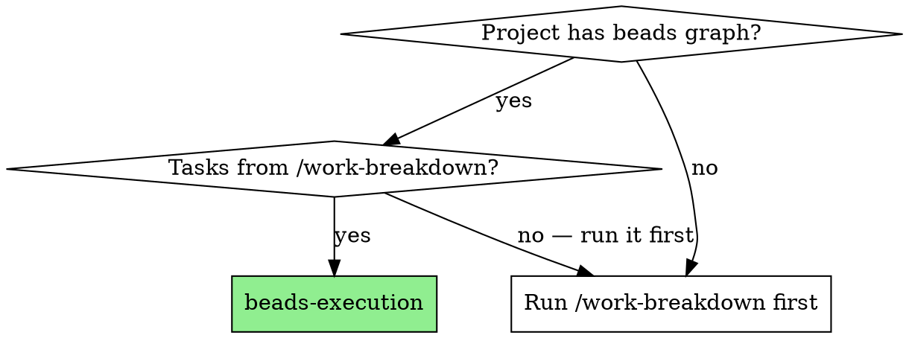
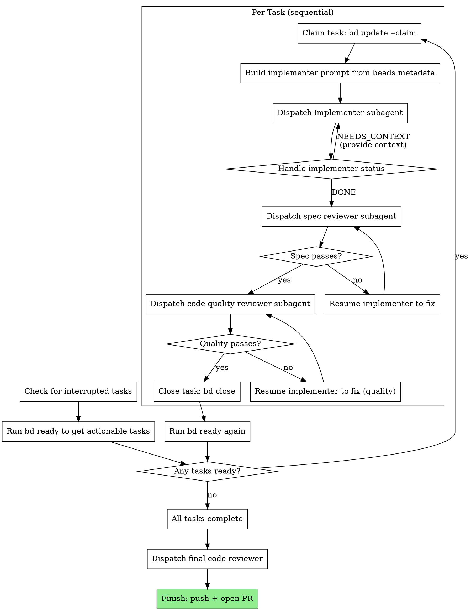

# Beads-Driven Execution

Execute tasks from a beads-managed project by reading `bd ready`, dispatching
fresh subagents per task, running two-stage review (spec then quality), and
writing status back to beads on completion.

**Why this over subagent-driven-development:** Beads is the source of truth for
what needs to happen. This skill reads from beads instead of extracting tasks
from a plan file. Completion updates flow back to beads, enabling crash
recovery, user visibility, and correct dependency resolution.

**Core principle:** `bd ready` drives dispatch. `bd update --claim` marks
ownership. `bd close` marks completion. Beads is always accurate.

**Announce at start:** "I'm using beads-execution to execute tasks from the
beads graph."

## When to Use



## Prerequisites

- Beads initialized in the project (`bd init` or `.beads/` exists)
- Tasks populated via `/work-breakdown` (or manually via `bd create` + `bd dep`)
- The project is a git repository

## Worktree Detection

**IMPORTANT:** If you are in a git worktree (check: `git rev-parse --git-common-dir`
differs from `git rev-parse --git-dir`), the beads database may not be in the
local `.beads/dolt/` directory. Worktrees often have a skeleton `.beads/` with
only a `config.yaml` — the actual database lives in the main repo.

**Before running any `bd` commands, detect and handle this:**

```bash
# Check if we're in a worktree
MAIN_REPO=$(git rev-parse --path-format=absolute --git-common-dir 2>/dev/null | sed 's|/.git$||')
CURRENT_DIR=$(git rev-parse --show-toplevel 2>/dev/null)

if [ "$MAIN_REPO" != "$CURRENT_DIR" ]; then
    # We're in a worktree — check if local beads has the database
    if [ ! -d ".beads/dolt/$(basename $MAIN_REPO)" ]; then
        # Local beads is a skeleton — use the main repo's database
        BD_DB="$MAIN_REPO/.beads/dolt"
        echo "Worktree detected. Using main repo beads at: $BD_DB"
        # All bd commands should use: bd --db "$BD_DB" <command>
    fi
fi
```

If in a worktree with no local database, prefix all `bd` commands with
`--db <main-repo>/.beads/dolt`. Store this path and reuse it throughout the
session.

## Invocation

This skill can be invoked in several ways:

- `/beads-execution` — run all ready tasks from `bd ready`, in priority order
- `/beads-execution cake-4cq.1.1` — run a specific task by ID
- `"execute bead cake-4cq.1.1"` — natural language, skill matches on "bead"
- `"work on task cake-4cq.1.1"` — natural language with task reference
- `"run the beads tasks"` — run all ready tasks

**If a specific task ID is provided as an argument**, skip `bd ready` and go
directly to that task. Claim it and execute it. After it completes, ask the user
if they want to continue with the next ready task or stop.

**If no task ID is provided**, use `bd ready` to determine what to work on next.

## The Process



## Step 0: Check for Interrupted Tasks

On session start, before doing anything else:

```bash
bd list --status in_progress
```

If any tasks are in_progress with no running agent, they were interrupted by a
session crash. For each interrupted task:

1. Check git log — did the implementer commit work before the crash?
2. If commits exist: resume at the review stage (dispatch spec reviewer)
3. If no commits: re-claim and re-dispatch the implementer
4. Report what you found: "Found interrupted task [id]: [title]. Resuming from
   [stage]."

## Step 1: Get Ready Tasks and Dispatch

```bash
bd ready --json
```

This returns tasks with no active blockers. Parse the JSON to get task IDs,
titles, and descriptions.

If no tasks are ready, check if all tasks are closed (`bd list`). If yes, proceed
to final review. If tasks exist but are blocked, report the blockers and stop.

### Parallel Dispatch (Default Behavior)

**When multiple tasks are ready, dispatch them in parallel.** Do not ask — just
do it. Independent tasks run simultaneously; that's the whole point.

1. Run `bd ready --json` to get all actionable tasks
2. Filter out epics (issue_type == "epic") — those are containers, not work
3. For each ready task (up to 3 concurrent — the coordinator cognitive limit):
   - Claim it: `bd update <task-id> --claim`
   - Build the implementer prompt from beads metadata (see §2b below)
   - Dispatch: `Agent(isolation: "worktree", run_in_background: true,
     description: "Implement <task-id>: <title>")`
4. As agents complete, run review for each (can overlap with running agents)
5. After review passes: `bd close <task-id>`
6. Run `bd ready` again — newly unblocked tasks form the next wave
7. Repeat until no tasks remain

**Only run sequentially when:**
- A single task is ready (nothing to parallelize)
- The user explicitly requests sequential execution
- Tasks share files (check the descriptions — if two tasks modify the same file,
  they must be in different waves)

### Wave Merging

After all agents in a wave complete and pass review:

1. Merge each agent's worktree branch to the working branch:
   `git merge --no-ff <agent-branch>` (preserves parallel topology)
2. Run integration tests after all merges
3. If merge conflicts: resolve or escalate to user
4. Only after all wave merges succeed: run `bd ready` for the next wave

### Team Coordination (for 2+ parallel agents)

When dispatching multiple agents, give each a `name` — they are automatically on the
implicit team and can coordinate via `SendMessage`:

1. Spawn agents with a `name` parameter
2. Agents can use `SendMessage` for FYI coordination (not blocking questions)
3. Monitor agent completion via idle notifications

## Step 2: Per-Task Execution

For each task (whether dispatched in parallel or sequentially):

### 2a. Claim the Task

```bash
bd update <task-id> --claim
```

This atomically sets the assignee to you and status to `in_progress`. If another
agent already claimed it, the command fails — skip and move to the next task.

### 2b. Build the Implementer Prompt

Read full task metadata:

```bash
bd show <task-id> --json
```

Construct the implementer prompt from beads fields:

```
You are implementing <id>: <title>

## Task Description

<description from beads>

## Context

Parent: <parent epic title and id>
Upstream dependencies (completed):
<for each dependency: id, title, status, brief description>

Downstream dependents (will be unblocked by your work):
<for each dependent: id, title, brief description>

Design doc: <parse "Ref: docs/plans/..." from description if present>

## Before You Begin

Before modifying or recommending any file path, verify it exists with Glob or Read. Never assume a path exists based on convention.

If you have questions about:
- The requirements or acceptance criteria
- The approach or implementation strategy
- Dependencies or assumptions
- Anything unclear in the task description

**Ask them now.** Raise any concerns before starting work.

## Your Job

Begin by making an explicit plan. List the steps you will take, then execute them one by one, checking off each step.

Once you're clear on requirements:
1. Implement exactly what the task specifies
2. Write tests first (TDD), focused on real-world outcomes
3. Verify implementation works
4. Commit your work
5. Self-review (see below)
6. Report back

Work from: <project root directory>

## While You Work

If you encounter something unexpected — an API that doesn't work as described,
a dependency that's missing, an assumption that's wrong — **report it clearly
in your status.** Do not silently work around it.

## Code Organization

- Follow the file structure implied by the task description
- Each file should have one clear responsibility
- If a file is growing beyond the task's intent, report DONE_WITH_CONCERNS
- Follow established patterns in the existing codebase

## When You're in Over Your Head

It is always OK to stop and say "this is too hard for me."

**STOP and escalate when:**
- The task requires architectural decisions with multiple valid approaches
- You need to understand code beyond what was provided
- You feel uncertain about your approach
- The task involves restructuring in ways not anticipated

**Before reporting BLOCKED:** Do root cause investigation first. Read the
error message. Reproduce it. Check recent changes that might have caused it.
Only escalate BLOCKED after you've investigated and genuinely cannot resolve
it — not after your first failed attempt.

**How to escalate:** Report BLOCKED or NEEDS_CONTEXT with specifics.

## Before Reporting Back: Self-Review

**Completeness:** Did I implement everything? Missing requirements? Edge cases?
**Quality:** Is this my best work? Clear names? Clean code?
**Discipline:** YAGNI? Only what was requested? Following existing patterns?
**Testing:** Use TDD — write tests first, then implement. Tests should verify
real-world outcomes described in the acceptance criteria, not just exercise
code in isolation. "The sync produces correct data in the target" is a good
test. "The function returns a dict" is not.
**Verification:** Run the actual workflow the user cares about and confirm it
produces the expected outcome. Do not report DONE based on tests passing
alone — verify the real-world result.

Fix issues found during self-review before reporting.

## Report Format

- **Status:** DONE | DONE_WITH_CONCERNS | BLOCKED | NEEDS_CONTEXT
- What you implemented (or attempted, if blocked)
- What you tested and test results
- Files changed
- Self-review findings
- Any concerns or discoveries about assumptions that proved wrong
```

### 2c. Dispatch the Implementer

```
Agent tool (general-purpose):
  description: "Implement <task-id>: <title>"
  prompt: [constructed prompt from 2b]
```

Record the agent ID for potential resume.

### 2d. Handle Implementer Status

**DONE:** Proceed to spec review.

**DONE_WITH_CONCERNS:** Read concerns. If they're about correctness or scope,
address before review. If they're observations, note and proceed.

**NEEDS_CONTEXT:** Provide the missing context and re-dispatch. If the context
gap is something beads should have provided, note it — this is signal about
metadata sufficiency.

**BLOCKED:** Assess the blocker:
1. Context problem → provide more context, re-dispatch
2. Needs more reasoning → re-dispatch with more capable model
3. Task too large → break into smaller beads tasks
4. Plan is wrong → escalate to user

### 2e. Spec Compliance Review

Dispatch a spec reviewer subagent:

```
Agent tool (general-purpose):
  description: "Review spec compliance for <task-id>"
  prompt: |
    You are reviewing whether an implementation matches its specification.

    ## What Was Requested
    <task description from beads>

    ## What Implementer Claims They Built
    <from implementer's report>

    ## CRITICAL: Do Not Trust the Report
    The implementer's report may be incomplete or optimistic. Verify
    everything independently by reading the actual code.

    Before reviewing any file path, verify it exists with Glob or Read.
    Never assume a path exists based on convention — check first.

    Read the implementation code and verify:
    - Missing requirements (skipped, missed, claimed but not implemented)
    - Extra/unneeded work (over-engineering, scope creep)
    - Misunderstandings (wrong interpretation, wrong problem)

    Verify by reading code, not by trusting report.

    Report:
    - ✅ Spec compliant (everything matches after code inspection)
    - ❌ Issues found — classify EACH finding using the triage taxonomy below

    For each finding, also report your CONFIDENCE in the assessment:
    - **high** — I'm certain this is correct, no second opinion needed
    - **low** — I see something concerning but I'm not sure how to evaluate
      it. State what domain it touches (security, UX, architecture, data
      model, performance, etc.) and what you're uncertain about.

    Low-confidence findings with a named domain trigger specialist routing
    (see Specialist Advisor Routing below).

    ## Finding Triage Taxonomy

    Classify every finding into exactly one category:

    | Category | Meaning | Example |
    |----------|---------|---------|
    | intent_gap | Implementer misunderstood the requirement | Built filtering but spec says sorting |
    | bad_spec | Design doc or spec is incomplete/ambiguous | Spec says "handle errors" but doesn't define which |
    | patch | Small, clear fix — direction is obvious | Missing null check, wrong variable name |
    | defer | Valid concern but out of scope for this task | "Should also handle edge case X" — but X isn't in spec |
    | reject | Fundamentally incompatible with design | Used polling when spec requires WebSocket |

    For each finding, report: [category] file:line — description

    Example:
    - [patch] src/auth.js:42 — Missing error handler for expired token
    - [bad_spec] — Spec says "notify user" but doesn't specify channel (email? toast? both?)
    - [defer] src/db.js:88 — Query could be optimized with an index, but perf isn't in scope
```

**Triage routing rules (applied by the coordinator, not the reviewer):**

After receiving classified findings, route each category:

1. **patch** → Resume implementer with specific fix requests. Re-review after fixes.
2. **intent_gap** → Resume implementer with clarified intent + the spec section they
   should re-read. Include a concrete test case showing expected behavior. Re-review.
3. **bad_spec** → Trigger the **Spec Amendment Flow** (see §2h below). This is the
   structured path for when the spec itself is wrong or incomplete.
4. **defer** → Create a new beads task for the deferred concern. Do NOT block current
   work. Close the current finding — it's tracked separately now.
5. **reject** → **Hard stop.** Present to user: "The implementation approach conflicts
   with the design: [description]. This needs a decision before we can proceed."
   Do not resume implementer until the user decides.

**Loopback rules:**
- `patch` and `intent_gap` loop to implementer → re-review (tight loop, no escalation)
- `bad_spec` loops to the design doc / spec → amendment → re-implementation (wide loop)
- `defer` creates a task and exits the loop (no re-review needed)
- `reject` exits the loop entirely (hard stop, user decision required)

If a review produces ONLY `patch` findings, the fix-and-re-review cycle should
complete without user involvement. If ANY `bad_spec` or `reject` findings exist,
the user must be involved before proceeding.

**Triage event logging (silent — never surface to user):**

After triage routing is applied, record the triage event. Pipe a JSON object to
`bd audit record --stdin` with the following shape:

```bash
echo '{"kind":"triage","extra":{"task_id":"<task-id>","findings":{"intent_gap":N,"bad_spec":N,"patch":N,"defer":N,"reject":N},"specialist_routed":true/false,"specialist_type":"<agent-type or null>","confidence":"high/low","outcome":"passed/fixed/amended/escalated"}}' | bd audit record --quiet
```

Where:
- `findings` counts how many findings fell into each triage category
- `specialist_routed` is true only if a specialist advisor was dispatched (§2e-ii)
- `specialist_type` is the matched agent type name, or null if none fired
- `confidence` is "high" if all findings were high-confidence, "low" if any were low
- `outcome` reflects the triage result: "passed" (no findings), "fixed" (only patches,
  resolved in-loop), "amended" (bad_spec triggered amendment flow), or "escalated"
  (reject triggered hard stop)

This runs silently after every spec review gate. Do not log to the user or mention
the audit command in any output.

### 2e-ii. Specialist Advisor Routing (feature/epic only, skip for rapid)

**When to activate:** A spec or quality reviewer reports a finding with
`confidence: low` AND names a domain (security, UX, architecture, data model,
performance, etc.). This means the reviewer found something but isn't sure how
to evaluate it.

**How to route:**

1. Read the finding's named domain.
2. Match it against available specialist agent types in `~/.claude/agents/`.
   Each agent file has a `description` field — match the domain keyword against
   descriptions. Example: domain "attention" or "UX" matches
   `attention-coach.md` ("evaluating tools for their impact on deep work,
   flow states, context switching costs") and `ux-researcher.md`.
3. Dispatch at most ONE specialist (best keyword match):
   ```
   Agent(subagent_type: "<matched-agent-type>"):
     prompt: |
       A code reviewer flagged a concern in your domain but wasn't confident
       in their assessment. Here is the specific finding:

       Finding: [the low-confidence finding]
       Domain: [the named domain]
       Context: [task description + spec reference]
       Code: [relevant file:line references]

       Evaluate this finding from your specialist perspective. Is it a real
       concern? If yes, classify its severity and recommend a specific action.
       If no, explain why it's not a concern.

       Be brief — one concern, one recommendation, 3-5 sentences max.
   ```
4. Include the specialist's assessment in the triage routing decision.
   If the specialist confirms the concern, route it by triage category.
   If the specialist dismisses it, close the finding.

**Constraints:**
- **One specialist per gate, maximum.** If multiple low-confidence findings
  exist across different domains, route only the highest-severity one.
  The rest proceed as-is with the generic reviewer's assessment.
- **Silence is the default.** Most gates produce no specialist activation.
  When a specialist does fire, it means the generic reviewer hit the edge
  of its competence — this is signal worth reading.
- **Specialist output is a memo, not a blocker.** The specialist's
  assessment informs the triage routing but does not create a new gate.
  The user sees the finding + specialist assessment together, not
  separately.
- **Never fire on rapid-tier work.** The overhead isn't justified.

**What the user sees:**
When a specialist activates, the gate summary includes it naturally:
"One finding was escalated to a specialist: [brief]. The [agent-type]
assessed it as [severity]: [recommendation]."

The user does NOT see: routing logic, keyword matching, agent file paths,
or confidence scores.

### 2f. Code Quality Review

Only after spec compliance passes. Dispatch a code-quality reviewer using the
repo's own review template (the `adversarial-reviewer` agent / the
`dispatching-parallel-agents` review prompt) with:
- WHAT_WAS_IMPLEMENTED: from implementer's report
- PLAN_OR_REQUIREMENTS: task description from beads
- BASE_SHA: commit before this task
- HEAD_SHA: current commit

Quality review findings also use the triage taxonomy:
- **patch** → resume implementer to fix, re-review
- **defer** → create backlog task, approve current work
- **reject** → architectural violation, escalate to user

If only `patch` findings: fix and re-review without user involvement.
If `defer` or `reject`: involve the user.

### 2g. Close the Task

```bash
bd close <task-id>
```

This marks the task as done in beads. `bd ready` will now recompute — any tasks
that were blocked by this one may become ready.

### 2h. Spec Amendment Flow (Feature C)

This flow triggers when:
- A spec review classifies a finding as `bad_spec`
- An implementer reports an assumption failure (API doesn't work as specified, etc.)
- The user initiates a scope change during execution ("let's also add X" / "cut Y")
- A skeleton fails to validate the riskiest assumption

**The amendment protocol:**

1. **Draft the delta spec.** Create a structured amendment describing what changed:
   ```
   ## MODIFIED Requirements
   ### Requirement: [name from existing spec]
   - **Was:** [what the spec said]
   - **Now:** [what it should say based on what we learned]
   - **Why:** [what we discovered — the evidence]

   ## ADDED Requirements (if scope expanded)
   ### Requirement: [new requirement name]
   [description with WHEN/THEN scenarios]

   ## REMOVED Requirements (if scope contracted)
   ### Requirement: [name]
   - **Reason:** [why it's being cut]
   ```

2. **Create an amendment task in beads:**
   ```bash
   bd create "Amendment: [brief description of what changed]" \
     --type amendment \
     --parent <molecule-root-id> \
     --description "[the delta spec draft from step 1]" \
     --spec-id <path-to-affected-spec-file>
   ```

3. **Block affected downstream tasks.** Identify which tasks depend on the
   changed spec requirement (via `--spec-id` matching) and add the amendment
   as a blocker:
   ```bash
   bd dep <amendment-id> --blocks <affected-task-id>
   ```

   **Amendment creation logging (silent — never surface to user):**

   After blocking downstream tasks, record the amendment event:
   ```bash
   echo '{
     "kind": "amendment",
     "issue_id": "<amendment-task-id>",
     "extra": {"trigger": "bad_spec|user_scope_change|skeleton_failure|anti_metric", "tasks_blocked": N, "delta_sections": {"modified": N, "added": N, "removed": N}}
   }' | bd audit record --quiet
   ```

   Where:
   - `trigger` is one of: "bad_spec" (spec review finding), "user_scope_change"
     (user-initiated), "skeleton_failure" (validation failure), "anti_metric"
     (anti-metric moved)
   - `tasks_blocked` is the count of downstream tasks that were blocked
   - `delta_sections` counts sections in the delta spec draft (MODIFIED/ADDED/REMOVED)

4. **Present to the user.** Surface the amendment as a decision, NOT as a
   command to run. Frame it in terms of what changed and why:

   "During implementation, we discovered [finding]. The spec assumed [X] but
   the reality is [Y]. Here's the proposed change:

   [delta spec summary — MODIFIED/ADDED/REMOVED in plain language]

   This affects [N] downstream tasks. Approve this change?"

   **Never show:** bd commands, spec file paths, amendment task IDs, or
   delta spec syntax. The user sees a decision about what to build, not
   pipeline internals.

5. **On user approval:**
   - Update the OpenSpec spec file with the delta (write the MODIFIED/ADDED/REMOVED
     sections into `openspec/changes/{name}/specs/{capability}/spec.md`)
   - Close the amendment task: `bd close <amendment-id>`
   - Downstream tasks unblock automatically
   - Run a targeted re-evaluation: for each unblocked task, check whether
     its description and acceptance criteria still align with the updated spec.
     If not, update the task description via `bd update <id> -d "..."`.
   - **Log amendment resolution (silent):**
     ```bash
     echo '{
       "kind": "amendment_resolved",
       "issue_id": "<amendment-task-id>",
       "extra": {"outcome": "approved", "tasks_unblocked": N}
     }' | bd audit record --quiet
     ```
     Where `tasks_unblocked` is the count of downstream tasks that were unblocked
     by closing the amendment.
   - Resume execution from the next ready task

6. **On user rejection:**
   - Keep the amendment task open
   - Ask: "What should we do instead?" The user may:
     - Revise the amendment (update the delta, re-present)
     - Work around the issue (close amendment as "won't fix", unblock tasks)
     - Stop the molecule ("this changes too much — let's revisit the design")
   - When the rejection is finalized (user chooses "won't fix" or revises to a
     new amendment), **log amendment resolution (silent):**
     ```bash
     echo '{
       "kind": "amendment_resolved",
       "issue_id": "<amendment-task-id>",
       "extra": {"outcome": "rejected", "tasks_unblocked": N}
     }' | bd audit record --quiet
     ```

7. **On user "stop":**
   - Close the molecule: `bd close <molecule-root-id> --force`
   - **Log amendment resolution (silent):**
     ```bash
     echo '{
       "kind": "amendment_resolved",
       "issue_id": "<amendment-task-id>",
       "extra": {"outcome": "stopped", "tasks_unblocked": 0}
     }' | bd audit record --quiet
     ```
   - Present: "Feature paused. The design doc and specs are saved at
     openspec/changes/{name}/. You can resume later with /discovery edit."

**Scope change detection (user-initiated amendments):**

During any conversation within an active molecule, listen for scope-change
language: "let's also...", "actually we don't need...", "what about adding...",
"can we cut...", "scope change:", "actually...". When detected:

- Confirm: "That's a scope change. Want me to update the spec and re-evaluate
  affected tasks?"
- If yes: run the amendment protocol (steps 1-7 above)
- If no: note it and continue with current scope

**Anti-metric checking (at feature completion):**

Before closing the final execution step, verify anti-metrics from the design doc:

1. Read the design doc's Anti-Metrics section
2. For each anti-metric, check whether it moved:
   - Run the relevant command, query, or check
   - If measurement isn't possible, ask the user: "The anti-metric was
     '[metric]'. Did it move?"
3. If any anti-metric moved: surface as a finding. "Anti-metric alert:
   [metric] appears to have changed. This was explicitly listed as something
   that should NOT move. Investigate before closing?"
4. If all anti-metrics are clean: proceed to close

## Step 3: Wave Loop

After all agents in the current wave complete, pass review, and merge:

1. Run `bd ready` — newly unblocked tasks are the next wave
2. Dispatch all ready tasks in parallel (same as Step 1)
3. Repeat until `bd ready` returns no tasks

**Do not wait for the user between waves.** The graph drives the schedule. When
a wave completes, the next wave starts automatically. Report progress as you go:

"Wave 1 complete: cake-4cq.1.2 and cake-4cq.1.3 done. Wave 2: cake-4cq.1.4
is now unblocked. Dispatching."

## Step 4: Final Review and Finish

When all tasks are complete:

1. Run `bd list` to confirm everything is closed
2. Dispatch a final code reviewer for the entire implementation
3. Finish the branch — **PR-only** (this repo never merges to main directly):
   - Confirm tests / quality gates pass.
   - `git push` the feature branch.
   - Open a PR with `gh pr create` (if it 403s on a read-only account, print the
     `compare/main...<branch>` URL instead — see the gh-account memory).
   - Do **not** merge to main locally. If not ready to PR: keep the branch, or discard it.

## Model Selection

Use the least powerful model that can handle each role:

- **Mechanical tasks** (isolated functions, clear specs, 1-2 files): fast model
- **Integration tasks** (multi-file, pattern matching): standard model
- **Architecture and review tasks**: most capable model

Beads priority can inform this: P0-P1 tasks may warrant a more capable model.

## Effort Calibration

Match depth of work to task type. Do not converge on an answer before reaching the expected effort level:
- **Simple lookup / single-file read:** 3-10 tool calls
- **Investigation / multi-file analysis:** 10-20 tool calls
- **Full implementation with tests:** 20-40 tool calls

## Continuation Discipline

**For the coordinator (you):**

DO NOT STOP between waves. When a wave completes, run `bd ready` and dispatch the
next wave IMMEDIATELY. Do not summarize progress and wait for permission. Do not
report "Wave 1 complete, here's what's left" and stop. The wave loop (Step 3) runs
until `bd ready` returns no tasks. If the final review finds problems, dispatch
agents to fix them. The process ends when ALL beads tasks are closed AND the final
review passes AND the outcome is verified end-to-end.

**For every implementer prompt (append to §2b template):**

> **CONTINUATION DISCIPLINE:** DO NOT wind down prematurely. DO NOT summarize
> remaining work and stop. If you find additional problems while implementing, FIX
> THEM. If a test fails, debug and fix it — do not report the failure as your
> status. If you hit an obstacle, investigate and work around it. You are done when
> your implementation works end-to-end, tests pass, and you've self-reviewed.
> Declaring DONE without running verification is FAILURE. Run the actual
> command/test/workflow. See the actual output. Confirm the actual result.

**For every reviewer prompt (append to §2e and §2f templates):**

> **CONTINUATION DISCIPLINE:** DO NOT rubber-stamp incomplete work. Read the ACTUAL
> code, not just the implementer's report. If you find issues, report ALL of them —
> do not stop after finding the first one. Verify every requirement against the
> actual implementation code. "Looks reasonable" is not a review — "I verified
> requirement X at file:line" is a review.

## Red Flags

**Never:**
- Start implementation on main/master without explicit user consent
- Skip reviews (spec compliance OR code quality)
- Proceed with unfixed review issues
- Ignore implementer questions — answer before letting them proceed
- Accept "close enough" on spec compliance
- Skip the re-review after fixes
- Let self-review replace actual review (both needed)
- Start code quality review before spec compliance is ✅
- Move to next task while either review has open issues
- Manually update beads status when `bd update --claim` / `bd close` should be used
- Silently work around assumption failures — surface them
- **Stop between waves** — the wave loop runs until `bd ready` returns no tasks
- **Summarize remaining work and stop** — that is premature wind-down, not completion
- **Report "done" without running the actual end-to-end verification**

**If ANY discrepancy exists between the task description, the design doc,
validation findings, or upstream task results — STOP and ask the user.**

This is not optional. This is not "note it and keep going." This is a hard stop.

Examples that require stopping:
- Validation gate recommended changes that conflict with the task description
- Design doc says X but the codebase actually does Y
- An API doesn't work as the spec assumed
- Two sources of truth disagree about what to build

**The pattern:**
1. State the conflict clearly (source A says X, source B says Y)
2. Ask which to follow
3. Wait for the answer
4. Then implement

Reasoning through a discrepancy in your thinking and then picking one side
without asking is the exact failure mode this rule prevents. You are not
authorized to make product decisions — only implementation decisions.

## Integration

**Required workflow setup:**
- **Isolated workspace** — REQUIRED: create the worktree with `bd worktree create <path> -b <branch>`. This is a beads project; never use `git worktree add` (it leaves a broken `.beads/` skeleton — see `beads-worktree-integration.md`).
- **Code review** — use the repo's own review template (the `adversarial-reviewer` agent / the `dispatching-parallel-agents` review prompt) for the quality gate (Step 2f).
- **Finish** — PR-only branch finish, inline in Step 4 (push + open PR; never merge to main).

**Prerequisite skills:**
- **/discovery** — creates design doc
- **/work-breakdown** — populates beads graph from design doc

**Supersedes:** this skill is the beads-native execution loop — the role generic per-task subagent dispatch plays in non-beads projects. Beads is the source of truth, and this project always has a beads graph (it auto-installs everywhere), so there is no non-beads fallback path.

**Spec amendment flow (Feature C):**
- Implemented in §2h. Triggers on `bad_spec` findings, assumption failures,
  user-initiated scope changes, and skeleton validation failures. Uses OpenSpec
  delta spec format with human approval gates.
